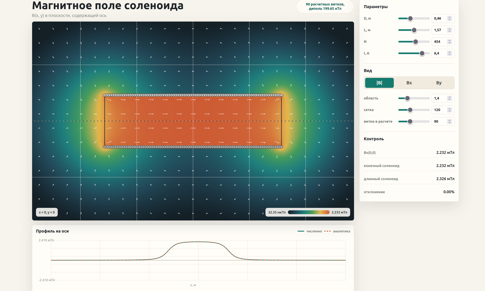
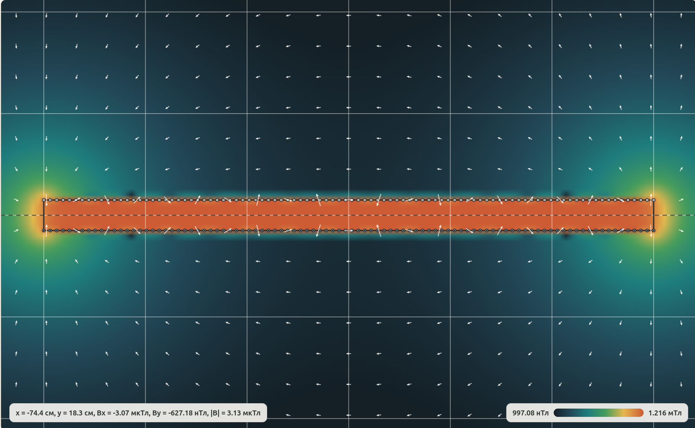
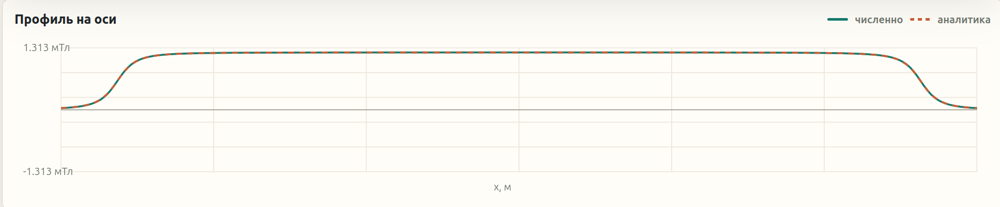

# Модель 1. Магнитное поле цилиндрического соленоида

## Постановка задачи

Построить численную модель и интерактивную визуализацию распределения магнитного поля **B(x, y)** в осевой плоскости цилиндрического соленоида конечной длины. Пользователь задаёт диаметр `D`, длину `L`, число витков `N`, ток `I`, размер расчётной области и детализацию сетки. Программа должна:

- рассчитывать векторное поле `(Bx, By)` в любой точке плоскости;
- визуализировать распределение в виде цветовой карты;
- строить профиль `Bx` на оси соленоида;
- сравнивать численный результат с аналитическими асимптотиками (центр длинного соленоида, конечный соленоид на оси, дипольная асимптотика).

## Физическая модель

### Поле одного кругового витка

Соленоид представляется как набор круговых витков радиуса `R = D/2` с центрами `x_i` на оси. Поле одного витка с током `I` в произвольной точке `(x, y)` осевой плоскости (в цилиндрических координатах `ξ = x − x_i`, `ρ = |y|`) выражается через полные эллиптические интегралы 1-го и 2-го рода:

```
α² = (R + ρ)² + ξ²
β² = (R − ρ)² + ξ²
m  = 4Rρ / α²

Bx = μ₀I / (2π·α) · [ K(m) + (R² − ρ² − ξ²)/β² · E(m) ]
Br = μ₀I·ξ / (2π·ρ·α) · [ −K(m) + (R² + ρ² + ξ²)/β² · E(m) ]
By = sign(y) · Br
```

На оси (`ρ → 0`) используется предельная аналитическая формула без эллиптических интегралов:

```
Bx = μ₀·I·R² / (2·(R² + ξ²)^(3/2)),    By = 0
```

### Суперпозиция витков

Полное поле соленоида получается суммированием по всем расчётным виткам с весами `w_i`:

```
B(x, y) = Σ_i B_loop(x − x_i, ρ) · w_i
```

При большом `N` соседние витки группируются в `M` расчётных элементов с весом `w_i = N/M`. Произведение `N·I` (ампер-витки) сохраняется, что обеспечивает корректность интегральных характеристик при ускоренном рендере.

### Проверочные аналитические формулы

Используются для валидации численного решения:

- **Поле на оси конечного соленоида** с плотностью витков `n = N/L`:
  ```
  Bx_axis(x) = μ₀·n·I/2 · [ (x + L/2)/√(R² + (x + L/2)²) − (x − L/2)/√(R² + (x − L/2)²) ]
  ```
- **Длинный соленоид в центре**: `Bx(0) ≈ μ₀·N·I / L`
- **Дальняя зона на оси (магнитный диполь)**: `Bx(x) ≈ μ₀·N·I·R² / (2|x|³)`

## Численный алгоритм

### Вычисление эллиптических интегралов

Полные эллиптические интегралы вычисляются прямой квадратурой **Гаусса–Лежандра** 28-го порядка на отрезке `[0, π/2]`:

```
K(m) = ∫₀^(π/2) dθ / √(1 − m·sin²θ)
E(m) = ∫₀^(π/2) √(1 − m·sin²θ) dθ
```

Узлы и веса квадратуры предвычисляются один раз методом Ньютона на корнях полинома Лежандра ([src/physics.js](src/physics.js)).

### Группировка витков

Функция `createLoopSamples(L, N, M)` равномерно расставляет до `M` расчётных витков на отрезке `[−L/2, L/2]`. Если `N ≤ M`, моделируется каждый виток отдельно. Иначе берётся `M` групп с весом `N/M`.

### Защита от сингулярности провода

Идеально тонкий провод даёт сингулярность поля на линии витка (`β → 0`). Для устойчивого рендера используется параметр `wireRadius`: знаменатель `β²` ограничивается снизу величиной `wireRadius²`. Это влияет только на пиксели в непосредственной близости от витков и не затрагивает зону, где проводятся тесты.

### Рендер карты

Для каждой ячейки сетки `(resolution × resolution)` вычисляется `(Bx, By)`, выбирается отображаемая величина (`|B|`, `Bx`, `By`) и применяется цветовая палитра (sequential для модуля, diverging для компонент).

## Структура проекта

```
model1/
├── index.html
├── styles.css
├── package.json
├── src/
│   ├── physics.js     — физическая модель, эллиптические интегралы, суперпозиция
│   └── app.js         — UI, Canvas-рендер карты и профиля
└── tests/
    └── physics.test.js
```

## Тест-кейсы

Файл `tests/physics.test.js` проверяет:

- предел эллиптических интегралов при `m = 0` (`K(0) = E(0) = π/2`);
- совпадение поля одного витка на оси с аналитической формулой;
- симметрии: `Bx(x, y) = Bx(x, −y)`, `By(x, y) = −By(x, −y)`;
- переход к формуле длинного соленоида при `L ≫ D`;
- совпадение суперпозиции витков с формулой конечного непрерывного соленоида на оси;
- дипольную асимптотику в дальней зоне;
- смену знака поля при смене знака тока.

## Запуск

```bash
npm test
npm run serve
```

После запуска сервера открыть `http://localhost:5173`.

## Скриншоты



*Рис. 1. Главный интерфейс: панель параметров, цветовая карта `|B(x, y)|`, профиль `Bx(x)` на оси.*



*Рис. 2. Длинный соленоид: внутри поле практически однородно и совпадает с асимптотикой `μ₀NI/L`, заметное искривление линий только у торцов.*



*Рис. 3. Профиль `Bx(x)` на оси: численное решение совпадает с формулой конечного соленоида в ближней зоне и переходит в дипольную асимптотику `~1/|x|³` вдали от соленоида.*

## Выводы

- Внутри длинного соленоида поле практически однородно, центральное значение стремится к `μ₀NI/L` при росте `L/D`.
- У торцов поле уменьшается примерно вдвое относительно центрального — характерное «рассеяние» поля.
- В дальней зоне поле быстро убывает как `1/|x|³`, что соответствует асимптотике магнитного диполя с моментом `m = N·I·π·R²`.
- Квадратура Гаусса–Лежандра 28-го порядка обеспечивает машинную точность вычисления `K(m)`, `E(m)` во всём диапазоне `m ∈ [0, 1)`, кроме узкой окрестности `m = 1` (отсекается обрезанием `m ≤ 1 − 10⁻¹²`).
