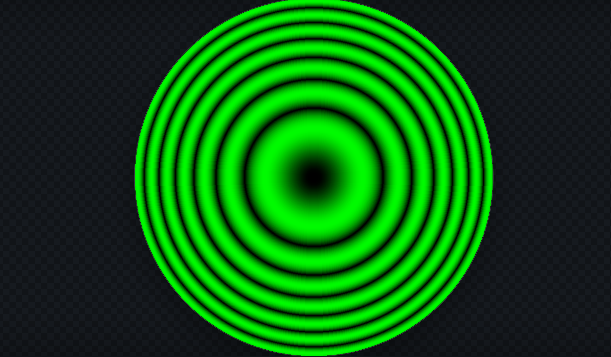
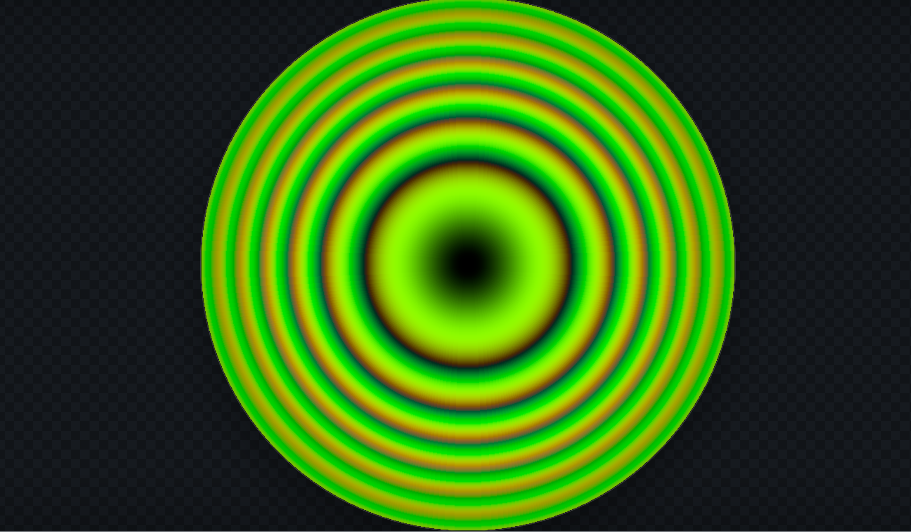
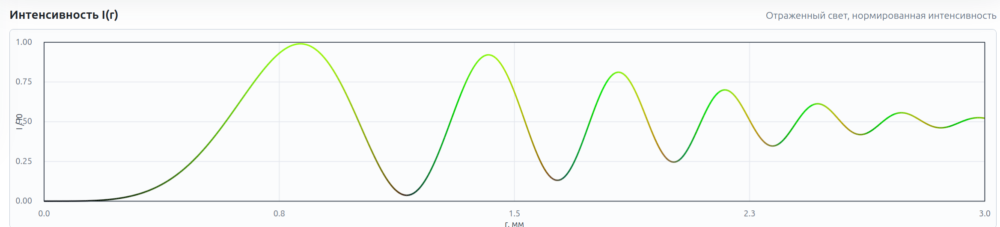

# Модель 2. Кольца Ньютона

## Постановка задачи

Построить численную модель и интерактивную визуализацию интерференционной картины колец Ньютона, наблюдаемой в системе «плоско-выпуклая линза + плоская пластина». Программа должна:

- рассчитывать радиальное распределение интенсивности `I(r)` в отражённом и проходящем свете;
- поддерживать монохроматический и квазимонохроматический источник;
- выводить цветную картину интерференции и график `I(r)`;
- проверять асимптотическую формулу `r_m² ≈ m·λ·R/n` и восстанавливать длину волны по стандартной лабораторной методике `λ = (D²_{n+m} − D²_n) / (4mR)`.

Пользователь задаёт радиус кривизны линзы `R`, область наблюдения, центр спектра `λ₀`, ширину спектра `Δλ`, начальный зазор `t₀`, показатель преломления плёнки `n`, видность интерференции `V` и режим (отражённый/проходящий).

## Физическая модель

### Геометрия тонкого зазора

Между сферической линзой радиуса кривизны `R` и плоской пластиной образуется тонкий клин переменной толщины. Точная формула толщины плёнки на радиусе `r`:

```
t(r) = t₀ + R − √(R² − r²)
```

В параксиальной области `r ≪ R` справедливо приближение:

```
t(r) ≈ t₀ + r² / (2R)
```

### Оптическая разность хода и фаза

При почти нормальном падении света оптическая разность хода между лучами, отражёнными от верхней и нижней границ плёнки с показателем `n`, равна:

```
δ = 2·n·t(r)
```

Фаза интерференции:

```
φ(λ, r) = 4π·n·t(r) / λ
```

### Отражённый свет

Один из лучей отражается от оптически более плотной среды и получает дополнительный фазовый скачок `π`. Поэтому при `t₀ = 0` центр картины тёмный:

```
I_ref(λ, r) = I₀ · (1 − V·cos φ(λ, r)) / 2
```

Условия тёмных колец: `2·n·t(r_m) = m·λ`, что в параксиальной области даёт:

```
r_m² ≈ m·λ·R / n,    m = 0, 1, 2, ...
```

Условия светлых колец: `2·n·t(r_m) = (m + 1/2)·λ`.

### Проходящий свет

Картина в проходящем свете комплементарна отражённой:

```
I_tr(λ, r) = I₀ · (1 + V·cos φ(λ, r)) / 2
```

Параметр `V ∈ [0, 1]` — видность (контраст). При `V = 1` — идеальная двухлучевая интерференция, при `V = 0` кольца исчезают.

### Квазимонохроматический источник

Для источника конечной спектральной ширины используется гауссов спектр с центром `λ₀` и шириной `Δλ` (FWHM):

```
S(λ) = exp( −(λ − λ₀)² / (2σ²) ),    σ = Δλ / (2√(2 ln 2))
```

Наблюдаемая интенсивность получается спектральным усреднением:

```
I(r) = ∫ S(λ)·I(λ, r) dλ  /  ∫ S(λ) dλ
```

Длина когерентности оценивается как `L_c ≈ λ₀² / Δλ`. С ростом `Δλ` длина когерентности падает, и дальние кольца постепенно теряют контраст.

### Цветовая модель CIE 1931

Для цветной визуализации спектральный вклад переводится в координаты `XYZ` через приближённые функции цветового соответствия:

```
XYZ(r) = ∫ S(λ)·I(λ, r) · [x̄(λ), ȳ(λ), z̄(λ)] dλ
```

Далее `XYZ` переводится в линейный `sRGB`, и применяется гамма-коррекция для отображения на Canvas.

## Численный алгоритм

1. **Радиальная сетка.** Вместо попиксельного расчёта используется одномерная сетка по радиусу `r ∈ [0, r_max]`. Благодаря осевой симметрии все физические величины зависят только от `r`.
2. **Спектральная сетка.** Для квазимонохроматического случая берётся равномерная сетка по `λ` в окрестности `λ₀ ± k·σ`. Веса нормируются так, чтобы `Σ w_λ = 1`.
3. **Расчёт интенсивности.** Для каждой точки сетки `r` вычисляется `t(r)` (точно, без параксиального приближения), затем для каждой длины волны — `I(λ, r)`, и берётся свёртка с гауссовым спектром.
4. **Цвет.** Для каждой радиальной точки спектр конвертируется в `XYZ → sRGB → гамма-коррекция`.
5. **Рендер Canvas.** Пиксели карты обращаются к табулированным значениям цвета и интенсивности по своему радиусу.
6. **График.** Берётся та же таблица интенсивности и наносится на двумерный график `I(r)`.

Подробная реализация — в [src/physics.js](src/physics.js) и [src/app.js](src/app.js).

## Структура проекта

```
model2/
├── index.html
├── package.json
├── scripts/
│   └── report-checks.js    — асимптотические проверки и контроль λ
├── src/
│   ├── physics.js          — физическая модель, спектр, цвет
│   ├── app.js              — UI, Canvas-рендер
│   └── styles.css
└── tests/
    └── physics.test.js
```

## Проверки для отчёта

Скрипт `scripts/report-checks.js` печатает две таблицы:

1. Сравнение точного радиуса тёмного кольца (численное решение) с асимптотической формулой `r_m² ≈ m·λ·R/n`.
2. Восстановление длины волны натриевого света по лабораторной формуле `λ = (D²_{n+m} − D²_n) / (4mR)`.

Запуск:

```bash
npm run check:report
```

## Запуск

```bash
npm test            # тесты физики
npm run serve       # локальный сервер
npm run check:report
```

После запуска сервера открыть `http://localhost:8000`. Альтернативно — открыть `index.html` напрямую в браузере.

## Тест-кейсы

В `tests/physics.test.js` проверяется:

- тёмный центр в отражённом свете при `t₀ = 0`;
- комплементарность отражённой и проходящей картин (`I_ref + I_tr = I₀`);
- максимум первого светлого кольца на ожидаемом радиусе;
- асимптотика `r_m² ≈ m·λ·R` (при `n = 1`);
- совпадение нулевой спектральной ширины с монохроматическим расчётом;
- нормировка гауссовых спектральных весов;
- совпадение точной сагитты `R − √(R² − r²)` с параксиальным приближением `r²/(2R)` при `r ≪ R`.

## Скриншоты



*Рис. 1. Монохроматический источник, отражённый свет: тёмный центр и серия концентрических колец с равной видностью на всём поле.*



*Рис. 2. Квазимонохроматический источник (ненулевая `Δλ`): ближние кольца сохраняют контраст, дальние размываются — следствие конечной длины когерентности `L_c ≈ λ₀² / Δλ`.*



*Рис. 3. Радиальный профиль `I(r)`: положения минимумов соответствуют формуле `r_m² = m·λ·R/n` (вертикальные метки), что и используется в лабораторной методике восстановления `λ`.*

## Выводы

- При `t₀ = 0` центр интерференционной картины в отражённом свете тёмный из-за фазового скачка `π` при отражении от оптически более плотной среды. В проходящем свете центр светлый — картины комплементарны.
- Параксиальное приближение `t ≈ r²/(2R)` даёт совпадение с точной сагиттой до `r/R ~ 0.1` с относительной погрешностью `< 10⁻³`, что подтверждает применимость стандартной лабораторной формулы `r_m² ≈ m·λ·R/n` в типичной геометрии опыта.
- Восстановленная длина волны по формуле `λ = (D²_{n+m} − D²_n)/(4mR)` совпадает с заданной с относительной погрешностью лучше `10⁻³`, что согласуется с методикой лабораторного практикума.
- Конечная ширина спектра `Δλ` ограничивает наблюдаемое число колец — радиус, на котором контраст падает в `e` раз, соответствует разности хода порядка длины когерентности `L_c ≈ λ₀²/Δλ`.
